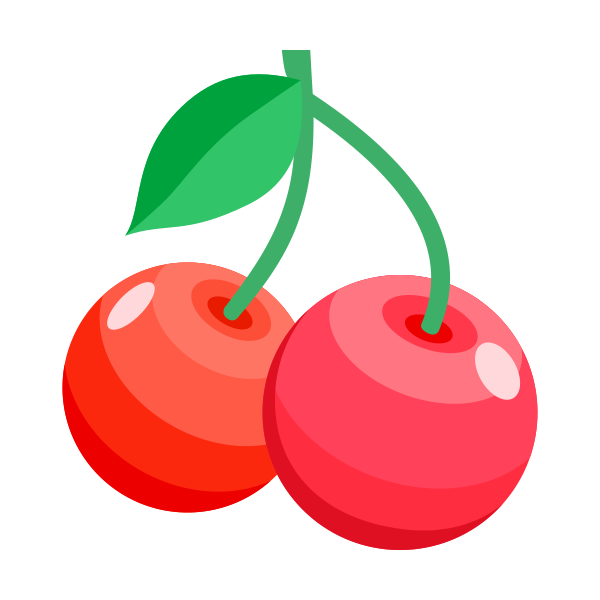

    

<h1 align="center">Multicolor Brackets</h1>

Multicolor Brackets for IntelliJ-based IDEs/Android Studio/HUAWEI DevEco Studio.

 

### Multicolor Brackets is a rainbow bracket lite version branch：[rainbow bracket lite](https://github.com/izhangzhihao/intellij-rainbow-brackets)

<!-- Plugin description -->
**Multicolor Brackets** for IntelliJ-based IDEs/Android Studio/HUAWEI DevEco Studio.
<!-- Plugin description end -->

## Compatibility

IntelliJ IDEA(Ultimate/Community/Educational), PhpStorm, WebStorm, PyCharm(Professional/Community/Educational), RubyMine, AppCode, CLion, CLion(Nova), Gogland, DataGrip, Rider, MPS, Android Studio, HUAWEI DevEco Studio, DataSpell, Code With Me(Host), RustRover, Aqua

## Supported languages

Java, Scala, Clojure, Kotlin, Python, Haskell, Agda, Rust, JavaScript, TypeScript, Erlang, Go, Groovy, Ruby, Elixir, Objective-C, PHP, HTML, XML, SQL, Apex language, C#, F#, Dart, Pug/Jade, Bash, Vue.js, C# Razor Pages, GLSL(the OpenGL Shading Language), Go Template, C++, C, Solidity, Jinja2, Clang, CPP, C...

NOTE: does NOT support C# lang and NOT support C++ in the Rider IDE

## Install

### Install it inside your IDE:

For Windows & Linux - <kbd>File</kbd> > <kbd>Settings</kbd> > <kbd>Plugins</kbd> > <kbd>Marketplace</kbd> > <kbd>Search for "Multicolor Brackets"</kbd> > <kbd>Install Plugin</kbd> > <kbd>Restart IntelliJ IDEA</kbd>

For Mac - <kbd>IntelliJ IDEA</kbd> > <kbd>Preferences</kbd> > <kbd>Plugins</kbd> > <kbd>Marketplace</kbd> > <kbd>Search for "Multicolor Brackets"</kbd> > <kbd>Install Plugin</kbd>  > <kbd>Restart IntelliJ IDEA</kbd>

### Download the [latest release](https://github.com/mustache-cn/multicolor-brackets/releases/latest) and install it manually using
  <kbd>Settings/Preferences</kbd> > <kbd>Plugins</kbd> > <kbd>⚙️</kbd> > <kbd>Install plugin from disk...</kbd>

## Disable multicolor brackets for specific languages

<kbd>Settings/Preferences</kbd> > <kbd>Other Settings</kbd> > <kbd>Multicolor Brackets</kbd> > `Do NOT Multicolor these languages (name or extension, comma separated)`: 

NOTE: You can use **name** of language or **extension** of file name(The names should be **lowercase**).